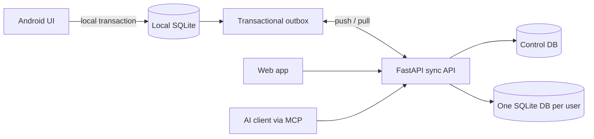

# lift-log

[繁體中文](README.zh-TW.md)

**A self-hosted, local-first workout log that lets AI agents read and write your data through MCP.**

Most fitness apps keep your history inside their cloud. lift-log keeps the Android app usable without
the server, synchronizes through a server you control, and exposes the same domain operations to Web
and AI clients.

> Pre-release: the core product is implemented, but the F149 production migration and release drill are
> still in progress. See [`feature_list.json`](feature_list.json) for the source-of-truth status.

## What it does

- Records workouts, sets, templates, body metrics, daily status, PRs, and calendar heatmaps.
- Runs the full core workflow offline on Android using a local SQLite store and transactional outbox.
- Synchronizes multiple devices with version conflicts, workout ownership, and a conflict inbox.
- Gives each Google account an isolated data database and independently revocable MCP tokens.
- Lets MCP clients query progress and log workouts through the same services used by REST and Web.
- Supports versioned JSON export, account deletion, encrypted backups, and restore drills.

## Screenshots

_TODO: production screenshots — to be added in a follow-up pass._

## Architecture



Android treats a local transaction as success; the network is not on the critical path for a workout.
Web and MCP are online clients. REST, Web, MCP, and sync mutations converge on the same service and
change-log path, so an AI-written workout can be pulled by the phone.

## Why this does not use RAG

Workout history is structured data. Questions such as “How much has my squat improved?” need exact SQL
filters and aggregates, not retrieval-augmented generation over text chunks. MCP tools provide typed,
auditable operations with deterministic results and fewer moving parts. If free-form daily notes grow
large enough to need search, SQLite FTS5 is sufficient before a vector database becomes justified.

## Quick start with Docker

Requirements: Git and a recent Docker Compose. Python and Node are not required.

```bash
git clone https://github.com/RyanLeeYi/lift-log.git
cd lift-log
cp .env.example .env
# Set LIFTLOG_TOKEN in .env to a long random value.
docker compose up --build
```

Open <http://localhost:8000>. This Compose file runs demo mode, which uses
`Authorization: Bearer <LIFTLOG_TOKEN>`. Docker stores databases in the `lift-log-data` named volume.

`LIFTLOG_TOKEN` is optional for the server itself: leave it unset and the shared-token path is disabled
entirely, so Google sign-in is the only way in. To enable multi-user sign-in, configure
`LIFTLOG_GOOGLE_CLIENT_ID`. Each signed-in user can then create personal MCP tokens; plaintext tokens
are shown once and only their hashes are stored.

## Connect an MCP client

Use the Streamable HTTP endpoint:

```text
URL: http://localhost:8000/mcp
Authorization: Bearer <token>
```

Demo mode accepts `LIFTLOG_TOKEN`. Multi-user mode uses a personal MCP token. Available tools cover
workout logging, progress, templates, body metrics, daily status, and other domain operations.

## Local development

Requirements: Python 3.12+ and [uv](https://docs.astral.sh/uv/).

```bash
cp .env.example .env
uv sync
uv run uvicorn app.main:app_factory --factory --reload
uv run pytest
uv run ruff check .
```

The frontend is native JavaScript and CSS served by FastAPI and packaged in a Capacitor Android shell;
there is no frontend build step. Android build and signing instructions are in
[`docs/android-build-setup.md`](docs/android-build-setup.md). Backup and recovery procedures are in
[`docs/operations.md`](docs/operations.md).

## Project docs

- Feature status and frozen acceptance (the only source of truth): [`feature_list.json`](feature_list.json)
- Local-first and multi-user design notes (historical, context only): [`docs/archive/local-first-cloud-sync.md`](docs/archive/local-first-cloud-sync.md)
- Original MVP design notes (historical, context only): [`docs/archive/mvp-lift-log.md`](docs/archive/mvp-lift-log.md)
- Development workflow: [`CLAUDE.md`](CLAUDE.md)

## License

[MIT](LICENSE) © 2026 Ryan Lee
