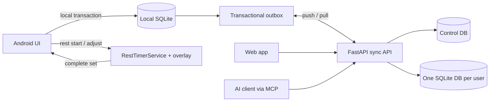

# lift-log

[繁體中文](README.zh-TW.md)

**A self-hosted, local-first workout log with a rest timer that floats over other apps, so you can finish a workout without ever switching back.**

Most fitness apps keep your history inside their cloud and expect you to keep the app open between sets. lift-log started from a single annoyance: rest time is when you scroll Instagram or YouTube, and switching back to the app to log the next set is exactly the friction that makes people stop logging. So the rest timer became a draggable floating window that stays on top of whatever you are doing, and the next set can be logged from that window.

Everything else followed from wanting that to be reliable: the Android app works without the server, synchronizes through a server you control, and exposes the same domain operations to Web and AI clients through MCP.

> Pre-release: the core product is implemented, but the F149 production migration and release drill are
> still in progress. See [`feature_list.json`](feature_list.json) for the source-of-truth status.

## The rest timer that lives outside the app

- **Floats over other apps.** A native Android overlay (`SYSTEM_ALERT_WINDOW`) shows the countdown while you are in any other app. If overlay permission is denied it falls back to a persistent notification with the same countdown.
- **Driven by native code, not the WebView.** Seconds come from a foreground service with a native `CountDownTimer`. The overlay is only ever needed when the app is in the background, which is exactly when WebView timers get throttled.
- **Log the next set without going back.** When the countdown ends, the window switches to a ready state showing the pending set (`weight kg x reps`) with +/- steppers and a "complete set" button. Tapping it records the set and starts the next rest, and the app is never brought to the front.
- **Pause, stop, +/-15 s** from the window or from the app; both sides stay in sync, including the notification.
- **Keeps counting past zero** and shows overtime instead of disappearing, so a long chat with a gym buddy is visible as such.
- **Survives app restarts and screen changes.** Rest state is persisted with the active workout; if Android kills the app the countdown resumes from real elapsed time. Navigating to templates, calendar, or another exercise does not cancel a rest.
- **Rest belongs to the exercise that started it.** Opening a different exercise while resting keeps the window visible and blocks accidental logging into the wrong exercise with a confirmation that names the rest still running.
- **Touch targets are 48 dp with 8 dp spacing.** Pressing stop by mistake and pressing close by mistake have very different consequences.

## What else it does

- Records workouts, sets, templates, body metrics, daily status, PRs, and calendar heatmaps.
- Runs the full core workflow offline on Android using a local SQLite store and transactional outbox.
- Synchronizes multiple devices with version conflicts, workout ownership, and a conflict inbox.
- Gives each Google account an isolated data database and independently revocable MCP tokens.
- Lets MCP clients query progress and log workouts through the same services used by REST and Web.
- Supports versioned JSON export, account deletion, encrypted backups, and restore drills.

## Screenshots

_TODO: production screenshots — to be added in a follow-up pass._

## Architecture



Android treats a local transaction as success; the network is not on the critical path for a workout.
Web and MCP are online clients. REST, Web, MCP, and sync mutations converge on the same service and
change-log path, so an AI-written workout can be pulled by the phone.

## Why this does not use RAG

Workout history is structured data. Questions such as “How much has my squat improved?” need exact SQL
filters and aggregates, not retrieval-augmented generation over text chunks. MCP tools provide typed,
auditable operations with deterministic results and fewer moving parts. If free-form daily notes grow
large enough to need search, SQLite FTS5 is sufficient before a vector database becomes justified.

## Quick start with Docker

Requirements: Git and a recent Docker Compose. Python and Node are not required.

```bash
git clone https://github.com/RyanLeeYi/lift-log.git
cd lift-log
cp .env.example .env
# Set LIFTLOG_TOKEN in .env to a long random value.
docker compose up --build
```

Open <http://localhost:8000>. This Compose file runs demo mode, which uses
`Authorization: Bearer <LIFTLOG_TOKEN>`. Docker stores databases in the `lift-log-data` named volume.

`LIFTLOG_TOKEN` is optional for the server itself: leave it unset and the shared-token path is disabled
entirely, so Google sign-in is the only way in. To enable multi-user sign-in, configure
`LIFTLOG_GOOGLE_CLIENT_ID`. Each signed-in user can then create personal MCP tokens; plaintext tokens
are shown once and only their hashes are stored.

## Connect an MCP client

Use the Streamable HTTP endpoint:

```text
URL: http://localhost:8000/mcp
Authorization: Bearer <token>
```

Demo mode accepts `LIFTLOG_TOKEN`. Multi-user mode uses a personal MCP token. Available tools cover
workout logging, progress, templates, body metrics, daily status, and other domain operations.

## Local development

Requirements: Python 3.12+ and [uv](https://docs.astral.sh/uv/).

```bash
cp .env.example .env
uv sync
uv run uvicorn app.main:app_factory --factory --reload
uv run pytest
uv run ruff check .
```

The frontend is native JavaScript and CSS served by FastAPI and packaged in a Capacitor Android shell;
there is no frontend build step. The rest timer, overlay, and foreground service are a small hand-written
Capacitor plugin under `android/app/src/main/java/com/ryanleeyi/liftlog/`. Android build and signing
instructions are in [`docs/android-build-setup.md`](docs/android-build-setup.md). Backup and recovery
procedures are in [`docs/operations.md`](docs/operations.md).

> [!NOTE]
> The overlay needs "Display over other apps" permission, which Android makes you grant per app in
> system settings; the app opens that page for you. Exact timing under aggressive OEM battery savers
> (Samsung in particular) is only verified on the devices we own.

## Project docs

- Feature status and frozen acceptance (the only source of truth): [`feature_list.json`](feature_list.json)
- Local-first and multi-user design notes (historical, context only): [`docs/archive/local-first-cloud-sync.md`](docs/archive/local-first-cloud-sync.md)
- Original MVP design notes (historical, context only): [`docs/archive/mvp-lift-log.md`](docs/archive/mvp-lift-log.md)
- Development workflow: [`CLAUDE.md`](CLAUDE.md)

## License

[MIT](LICENSE) © 2026 Ryan Lee
