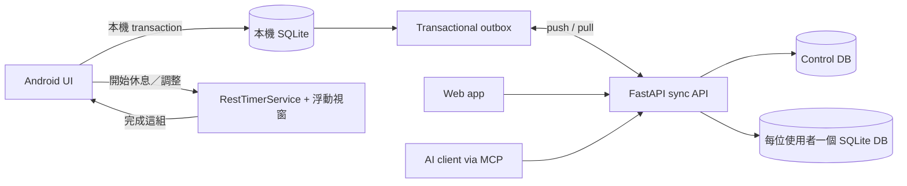

# lift-log

[English](README.md)

**可自架、Local-first 的健身紀錄器，休息倒數浮在其他 app 上層，整場訓練不用切回 app 就能記完。**

多數健身 App 把歷史資料鎖在自家雲端，還預設你組間會一直開著它。lift-log 的起點只是一個小煩躁：
休息時間本來就是滑 Instagram 或 YouTube 的時間，為了記下一組還得切回 app，這個摩擦正是讓人放棄記錄的原因。
所以休息倒數做成一顆可拖曳的浮動視窗，停在你正在用的任何 app 上面，下一組直接在那顆視窗上記掉。

其他一切都是為了讓這件事可靠而長出來的：Android 在沒有伺服器時照常可用，恢復連線後同步到自己控制的伺服器，
Web 與 AI client 透過 MCP 共用同一套 domain 操作。

> 尚未正式發布：核心產品已完成，但 F149 的正式資料遷移與發布演練仍在進行中。
> 實際進度以 [`feature_list.json`](feature_list.json) 為準。

## 活在 app 外面的休息倒數

- **浮在其他 app 上層。** 原生 Android overlay（`SYSTEM_ALERT_WINDOW`）在任何 app 裡都看得到倒數；沒授權 overlay 就退回通知列常駐倒數，內容一樣。
- **由原生驅動，不靠 WebView。** 秒數來自前景服務的原生 `CountDownTimer`。浮動視窗只在 app 進背景時才需要，而那正是 WebView 計時器被節流的時候。
- **不回 app 就記下一組。** 倒數歸零後視窗切成就緒態，顯示待記的那組（`重量 kg x 次數`）與正負步進和「完成這組」；按下去就記錄並開始下一輪休息，app 從頭到尾不會被拉到前景。
- **暫停、停止、正負 15 秒**在視窗與 app 內都能操作，兩邊即時同步，通知列也跟著變。
- **歸零後不消失，改顯示超時**，跟朋友多聊了兩分鐘看得一清二楚。
- **撐得過 app 被回收與換畫面。** 休息狀態隨進行中的訓練一起持久化，app 被系統殺掉後依實際經過時間續算；切到課表、日曆或別的動作都不會取消休息。
- **休息綁定發起它的動作。** 休息中打開別的動作，視窗維持顯示，而且記組前會跳確認，把還在跑的那輪休息講清楚，不會靜默記到錯的動作。
- **按鈕 48 dp、間距 8 dp。** 按錯「停止」與按錯「關閉」的後果差很多。

## 其他能做什麼

- 記錄 workout、訓練組、課表、體重體脂、每日狀態、PR 與日曆 heatmap。
- Android 以本機 SQLite 與 transactional outbox 完成完整離線訓練流程。
- 多裝置同步支援版本衝突、進行中 workout 擁有權與 conflict inbox。
- 每個 Google 帳號使用隔離的 data DB，並能建立、撤銷自己的 MCP token。
- MCP client 能查詢進步與代記錄，且與 REST／Web 共用相同 service 邏輯。
- 支援版本化 JSON 匯出、刪除帳號、加密備份與 restore drill。

## 螢幕截圖

_待補：正式螢幕截圖將於後續作業補上。_

## 架構



Android 以本機 transaction 成功作為操作完成，網路不在訓練流程的 critical path；Web 與 MCP
則是 online client。REST、Web、MCP 與 sync 的 mutation 最終都走同一套 service 與 change log，
因此 AI 寫入的訓練能被手機同步回來。

## 為什麼不用 RAG

健身紀錄是結構化資料。「我的深蹲進步多少？」需要的是精確的 SQL 篩選與聚合，不是從文字切片做
檢索增強生成（Retrieval-Augmented Generation, RAG）。MCP tool 提供有型別、可稽核且結果穩定的
操作，也少一套 embedding 與 vector database 的維運成本。若未來自由文字狀態多到需要搜尋，
SQLite FTS5 已足夠；在它真的不夠以前，不引入向量資料庫。

## 用 Docker 快速啟動

需要 Git 與近期版本的 Docker Compose；不需要先安裝 Python 或 Node。

```bash
git clone https://github.com/RyanLeeYi/lift-log.git
cd lift-log
cp .env.example .env
# 把 .env 的 LIFTLOG_TOKEN 設成夠長的隨機值。
docker compose up --build
```

開啟 <http://localhost:8000>。這份 Compose 跑的是 demo 模式，使用
`Authorization: Bearer <LIFTLOG_TOKEN>`；資料會保存在 `lift-log-data` named volume。

對 server 本身而言 `LIFTLOG_TOKEN` 是選填的：留空即整條共用 token 路徑關閉，只能用 Google 登入。
若要啟用多帳號登入，設定 `LIFTLOG_GOOGLE_CLIENT_ID`。登入後每位使用者可建立自己的 MCP token；
明文只顯示一次，server 僅保存 hash。

## 連接 MCP client

使用 Streamable HTTP endpoint：

```text
URL: http://localhost:8000/mcp
Authorization: Bearer <token>
```

Demo 模式使用 `LIFTLOG_TOKEN`；多帳號模式使用個人 MCP token。Tools 涵蓋訓練記錄、進步查詢、
課表、體重體脂、每日狀態與其他 domain 操作。

## 本機開發

需要 Python 3.12+ 與 [uv](https://docs.astral.sh/uv/)。

```bash
cp .env.example .env
uv sync
uv run uvicorn app.main:app_factory --factory --reload
uv run pytest
uv run ruff check .
```

前端是由 FastAPI 直接提供、並封裝進 Capacitor Android shell 的原生 JavaScript／CSS，沒有前端
build step。休息倒數、浮動視窗與前景服務是一個自寫的小型 Capacitor plugin，在
`android/app/src/main/java/com/ryanleeyi/liftlog/`。Android 建置與簽章見
[`docs/android-build-setup.md`](docs/android-build-setup.md)；備份與還原見 [`docs/operations.md`](docs/operations.md)。

> [!NOTE]
> 浮動視窗需要「顯示在其他應用程式上層」權限，Android 要求逐 app 在系統設定手動開，app 會直接帶你到那一頁。
> 在激進的 OEM 省電策略（尤其 Samsung）下的準時性，只在我們手上的機器驗證過。

## 專案文件

- Feature 狀態與 frozen acceptance（唯一權威來源）：[`feature_list.json`](feature_list.json)
- Local-first 與多帳號設計筆記（歷史文件，僅供參考）：[`docs/archive/local-first-cloud-sync.md`](docs/archive/local-first-cloud-sync.md)
- 原始 MVP 設計筆記（歷史文件，僅供參考）：[`docs/archive/mvp-lift-log.md`](docs/archive/mvp-lift-log.md)
- 開發流程：[`CLAUDE.md`](CLAUDE.md)

## 授權

[MIT](LICENSE) © 2026 Ryan Lee
